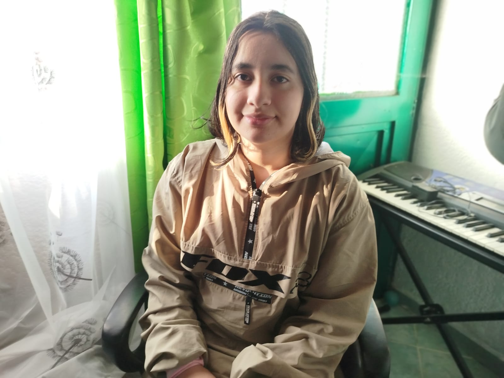

# Reconocimiento SCV

Esta actividad tiene como propósito introducir al estudiante al desarrollo de videojuegos y al contexto de la industria, identificando los roles más relevantes y promoviendo la conformación de equipos de trabajo.

**Nombre:** Brenda Sofia Ramirez Hernendez
**Rol en la industria:** Ingeniería Multimedia
**Ubicacion:** Sibaté CUNDINAMARCA
---
Soy estudiante de ingeniería multimedia con 20 años de edad, cursando mi septimo semestre en la universidad de la UNAD.